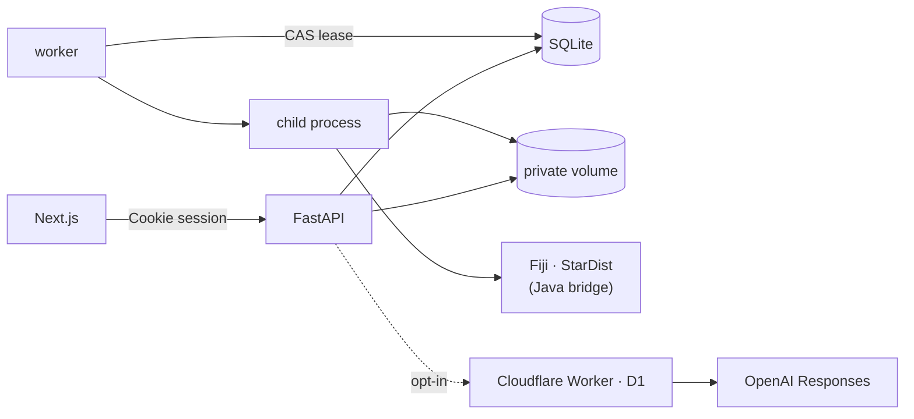

# Cytellect

**Get your microscopy publication-ready.**

2D 蛍光顕微鏡画像から核・核小体を検出・定量し、実験単位の統計と論文用の図までを一つのワークスペースで扱う解析アプリケーション。Web・Windows ローカル版・Docker を同一の解析コードで提供する。開発中のプロトタイプ。


## アーキテクチャ



| | |
|---|---|
| `apps/web` | Next.js 16 / React 19。数値計算を持たず、API の保存値だけを描画。型は OpenAPI から生成 |
| `services/api` | FastAPI、54 エンドポイント、SQLite + Alembic。認証、入力検証、revision とジョブの管理 |
| `services/worker` | ジョブを CAS lease で取得し、1 ジョブ 1 子プロセスで実行。時間・RSS 超過でプロセスグループごと停止 |
| `packages/analysis` | 測定・統計・作図・書き出し・replay（45 モジュール）。API とワーカーで共有 |
| `engines/fiji` | Fiji / StarDist 2D / MorphoLibJ の lock と Java ブリッジ |
| `services/proposal-worker` | 解析計画提案の中継（Cloudflare Workers + D1）。既定で無効 |

## 技術スタック

| | |
|---|---|
| Web | Next.js 16 · React 19 · TypeScript 6 |
| API | Python 3.12 · FastAPI · Pydantic 2 · SQLAlchemy 2 · Alembic · SQLite |
| 解析 | NumPy · SciPy · statsmodels · pandas · scikit-image · tifffile · Matplotlib |
| 画像処理 | Fiji · StarDist 2D 0.3.0 · TensorFlow 1.15 (Java) · MorphoLibJ 1.6.5 |
| LLM | Cloudflare Workers · D1 · OpenAI Responses API (Structured Outputs) |
| 配布 | Vercel · GitHub Releases · Docker Compose |
| 検証 | Pytest · Vitest · Playwright · Ruff · mypy · Gitleaks · pip-audit · CycloneDX |

## 実装

### 画像入力と Fiji 連携

- OME-XML と TIFF の IFD を突き合わせ、軸・dtype・plane 数・ストリップ位置まで検証。欠損 plane の補完や外部参照 OME は拒否
- Fiji はリポジトリに同梱せず、archive・StarDist モデル・プラグインを SHA-256 で lock。実行前に毎回照合し、実行時のダウンロードはしない
- Python から Java ブリッジ（`engines/fiji/CytellectEngine.java`）をヘッドレス起動。正規化は複製に対してのみ行い、ラベル画像は元座標で受け取る

### ジョブと revision

- 検出・修正・除外・背景変更はすべて immutable な revision。核の変更で子の核小体と派生統計・図を無効化する
- ジョブは SQLite 上の compare-and-swap で lease を取得。lease が切れたワーカーは結果を確定できない（fencing）
- API は `202` で受け付け、取り消し・再試行に対応。ワーカーは psutil で子プロセスツリーの経過時間と RSS を監視する

### 決定的な出力と replay

- Matplotlib（Agg）の jitter seed、SVG hashsalt、メタデータを固定。PDF はフォントを埋め込み、使用フォントの SHA-256 を記録
- zip のタイムスタンプを固定し、同じ入力から同じバイト列を生成
- 書き出しに SHA-256 manifest と `replay.py` を同梱。受け取った側で測定・統計・図を再計算し、一致を検査できる

### 認証とデータ境界

- 招待トークン → `HttpOnly`・`SameSite=Strict` Cookie。トークンは SHA-256 ダイジェストのみ保存
- 変更系リクエストは Origin と `X-Cytellect-Request` を検証。他人のリソースは 404
- データはリポジトリ外の非公開ボリュームに置き、最終操作から 24 時間で削除
- Docker：UID 10001、読み取り専用ルート、`cap_drop: ALL`、`no-new-privileges`。ワーカーは `network_mode: none`

### LLM 連携

- Pydantic の契約から strict JSON Schema を生成し、Worker と CI で同一性を検査。モデルは閉じた enum から選ぶだけ
- 返答はローカルの意味検査（番号だけのチャンネルへの染色名、実験単位なしの検定などを拒否）を通ってから表示。数値計算には使わない
- 送信は利用者の有効化と毎回の同意が条件（なければ `428`）。送るのはチャンネル記号・件数・目的文のみ。リダイレクト拒否、`store: false`、本文はログに残さない
- 費用は呼び出し前に最悪値を D1 に 1 文の SQL で予約。精算はトリガーで原子的・冪等に行い、未精算の予約も上限に数え続ける

### Windows 配布

- PSF 公式の Python 3.14.8 と Tcl/Tk 9.0.4 から実行環境を組み立て、venv ランチャーの Authenticode 署名を検証。実行ファイルの書き換え・再署名はしない
- 依存は `uv export --locked` のハッシュ付き要件で導入。システムの Python・PATH・既存の Fiji には触れない
- 更新時は新しい版の起動と Fiji の数値確認が通るまで旧版を保持し、記録と一致する旧版だけを削除。研究データは対象外
- ランチャーは `127.0.0.1` のみで待ち受け、ローカル専用のセッション確立でトークン入力を不要にしている

## CI

| ジョブ | 内容 |
|---|---|
| `python` | Ruff、mypy、1,300 件超の非 Fiji テスト（統計は閉形式解・全列挙と照合）、全履歴の秘密情報スキャン、依存監査、SBOM |
| `web` | OpenAPI → TypeScript 型の再生成差分、型検査、単体テスト、ビルド、Playwright |
| `fiji-browser` | 実 Fiji で公開画像を解析し ImageJ の独立計算と照合、実 API に対する E2E、network none・read-only コンテナでの Fiji 実行 |
| `local-windows` | Windows でのセットアップと起動・終了の境界試験 |
| `python-windows-314` | Windows / Python 3.14 の全テスト |

Windows 版は配布 ZIP をクリーン環境に導入し、ブラウザ試験 26 件と replay 照合を通過した版だけを公開する。

## 開発環境

```bash
uv sync --locked --dev
pnpm install --frozen-lockfile
uv run python scripts/fiji_setup.py ~/cytellect-fiji --platform linux-x64

export CYTELLECT_DATA_DIR=~/cytellect-data CYTELLECT_FIJI_EXECUTABLE=~/cytellect-fiji CYTELLECT_SECURE_COOKIES=false
uv run cytellect invite --hours 24
uv run cytellect serve & uv run cytellect-worker & pnpm dev
```

Python 3.12 · Node.js 24 · pnpm 11.19.0 · uv。テストは `uv run pytest` / `pnpm test`。

## ライセンス

Apache License 2.0。Fiji、モデルの重み、公開データセットはそれぞれのライセンスに従う。

利用者向けの機能説明：[docs/implementation-overview.ja.md](docs/implementation-overview.ja.md) · Windows 版：[Releases](https://github.com/genellect/cytellect/releases)
