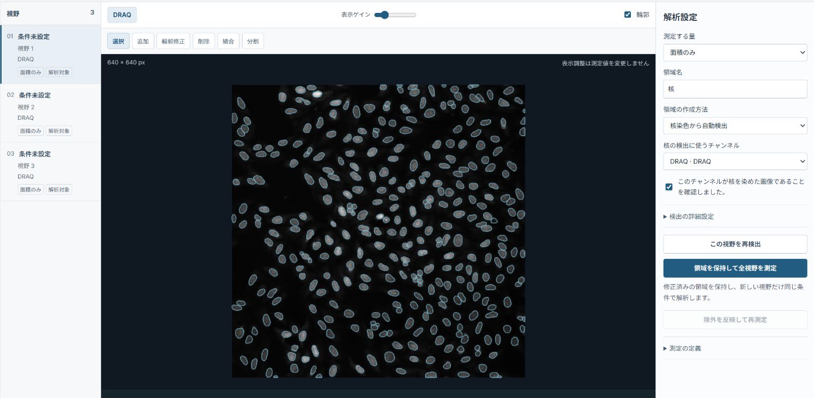
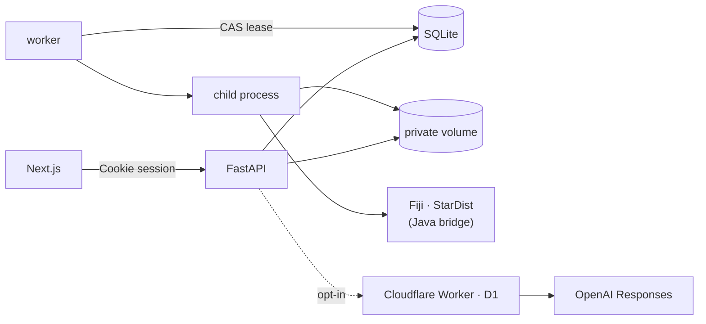

# Cytellect

**Get your microscopy publication-ready.**

[解析例を見る](https://cytellect.vercel.app/workspace?demo=bbbc013) · [Windows版をダウンロード](https://github.com/genellect/cytellect/releases/tag/v0.1.0-local.17) · [解析機能の説明](docs/implementation-overview.ja.md)

Cytellect は、2D 蛍光顕微鏡画像から核と核小体を検出・定量し、実験単位の統計解析と論文用の図の作成までを一つのワークスペースで行う解析アプリケーションです。Web、Windows ローカル版、Docker の3つの形態を、同じ解析コードで提供しています。現在は開発中のプロトタイプです。



## アーキテクチャ



| | |
|---|---|
| `apps/web` | Next.js 16 / React 19。数値計算は持たず、API に保存された値だけを描画。型は OpenAPI から生成 |
| `services/api` | FastAPI（54 エンドポイント）、SQLite + Alembic。認証、入力検証、revision とジョブの管理 |
| `services/worker` | ジョブを CAS lease で取得し、1ジョブ1子プロセスで実行。時間・メモリ超過時はプロセスグループごと停止 |
| `packages/analysis` | 測定・統計・作図・書き出し・replay（45 モジュール）。API とワーカーで共有 |
| `engines/fiji` | Fiji / StarDist 2D / MorphoLibJ の lock と Java ブリッジ |
| `services/proposal-worker` | 解析計画提案の中継（Cloudflare Workers + D1）。既定で無効 |

## 技術スタック

| | |
|---|---|
| Web | Next.js 16 · React 19 · TypeScript 6 |
| API | Python 3.12 · FastAPI · Pydantic 2 · SQLAlchemy 2 · Alembic · SQLite |
| 解析 | NumPy · SciPy · statsmodels · pandas · scikit-image · tifffile · Matplotlib |
| 画像処理 | Fiji · StarDist 2D 0.3.0 · TensorFlow 1.15 (Java) · MorphoLibJ 1.6.5 |
| LLM | Cloudflare Workers · D1 · OpenAI Responses API (Structured Outputs) |
| 配布 | Vercel · GitHub Releases · Docker Compose |
| 検証 | Pytest · Vitest · Playwright · Ruff · mypy · Gitleaks · pip-audit · CycloneDX |

## 実装

### 画像入力と Fiji 連携

画像の読み込みでは、OME-XML と TIFF の IFD を突き合わせ、軸、dtype、plane 数、ストリップの位置まで検証しています。欠けた plane を補ったり、外部ファイルを参照する OME を読んだりはしません。

Fiji はリポジトリに同梱していません。Fiji 本体、StarDist のモデル、プラグインを SHA-256 で lock し、実行前に毎回照合しています。実行時に依存を取得することはありません。Python からは Java ブリッジ（`engines/fiji/CytellectEngine.java`）をヘッドレスで起動し、正規化は画像の複製にだけかけ、ラベル画像は元画像と同じ座標で受け取ります。

### ジョブと revision

検出、修正、除外、背景の変更は、すべて immutable な revision として記録しています。核を変更すると、その子である核小体と、そこから作った統計・図を無効にします。

ジョブは SQLite 上の compare-and-swap で lease を取得します。lease が切れたワーカーは結果を確定できないため、古いワーカーによる上書きは起きません。API は要求を `202` で受け付け、取り消しと再試行に対応しています。ワーカーは psutil で子プロセスツリーの経過時間とメモリ使用量を監視しています。

### 決定的な出力と replay

Matplotlib（Agg）の jitter の seed、SVG の hashsalt、メタデータを固定し、zip のタイムスタンプもそろえています。そのため、同じ入力からは同じバイト列が生成されます。PDF にはフォントを埋め込み、使用したフォントの SHA-256 も記録しています。

書き出しには、SHA-256 の manifest と `replay.py` を同梱しています。受け取った側で測定・統計・図を再計算し、元の出力と一致するかを確かめられます。

### 認証とデータ境界

認証は、招待トークンを `HttpOnly`・`SameSite=Strict` の Cookie に交換する方式です。トークン自体は保存せず、SHA-256 のダイジェストだけを保存します。状態を変える要求では Origin と `X-Cytellect-Request` ヘッダーを検証し、他人のリソースには 404 を返します。

データはリポジトリ外の非公開ボリュームに置き、最終操作から24時間で削除します。Docker では、UID 10001、読み取り専用ルート、`cap_drop: ALL`、`no-new-privileges` で各コンテナを動かし、ワーカーは `network_mode: none` でネットワークから切り離しています。

### LLM 連携

Pydantic の契約から strict な JSON Schema を生成し、Worker 側の定義と一致しているかを CI で検査しています。モデルは閉じた enum の中から選ぶだけで、返答はローカルの意味検査を通してから表示します。番号だけのチャンネルに染色名を付ける案や、実験単位がないのに検定する案はここで除外します。数値の計算に LLM は使いません。

送信は、利用者が機能を有効にし、毎回同意した場合に限ります（同意がなければ `428`）。送るのはチャンネルの記号、件数、目的の文だけです。リダイレクトは拒否し、`store: false` で送信し、本文はログに残しません。費用は呼び出しの前に最悪の金額を D1 に1つの SQL 文で予約し、精算はトリガーで原子的かつ冪等に行います。精算されない予約も、上限の計算に含め続けます。

### Windows 配布

実行環境は、PSF 公式の Python 3.14.8 と Tcl/Tk 9.0.4 から組み立て、venv ランチャーの Authenticode 署名を検証しています。実行ファイルの書き換えや再署名はしていません。依存は `uv export --locked` で出力したハッシュ付きの要件から導入し、システムの Python、PATH、既存の Fiji には触れません。

更新時は、新しい版の起動確認と Fiji の数値確認が通るまで旧版を残し、記録と一致する旧版だけを削除します。研究データは削除の対象にしません。ランチャーは `127.0.0.1` だけで待ち受け、ローカル専用の手順でセッションを確立するため、トークンの入力は不要です。

## CI

| ジョブ | 内容 |
|---|---|
| `python` | Ruff、mypy、1,300 件を超える非 Fiji テスト（統計は閉形式解・全列挙と照合）、全履歴の秘密情報スキャン、依存監査、SBOM |
| `web` | OpenAPI → TypeScript 型の再生成差分、型検査、単体テスト、ビルド、Playwright |
| `fiji-browser` | 実 Fiji で公開画像を解析して ImageJ の独立計算と照合、実 API に対する E2E、network none・読み取り専用コンテナでの Fiji 実行 |
| `local-windows` | Windows でのセットアップと起動・終了の境界試験 |
| `python-windows-314` | Windows / Python 3.14 での全テスト |

Windows 版は、配布する ZIP をクリーンな環境に導入し、ブラウザ試験26件と replay の照合を通過した版だけを公開しています。

## 開発環境

Python 3.12、Node.js 24、pnpm 11.19.0、uv を使用します。

```bash
uv sync --locked --dev
pnpm install --frozen-lockfile
uv run python scripts/fiji_setup.py ~/cytellect-fiji --platform linux-x64

export CYTELLECT_DATA_DIR=~/cytellect-data CYTELLECT_FIJI_EXECUTABLE=~/cytellect-fiji CYTELLECT_SECURE_COOKIES=false
uv run cytellect invite --hours 24
uv run cytellect serve & uv run cytellect-worker & pnpm dev
```

テストは `uv run pytest` と `pnpm test` で実行します。

## ライセンス

Apache License 2.0 で公開しています。Fiji、モデルの重み、公開データセットには、それぞれのライセンスが適用されます。
