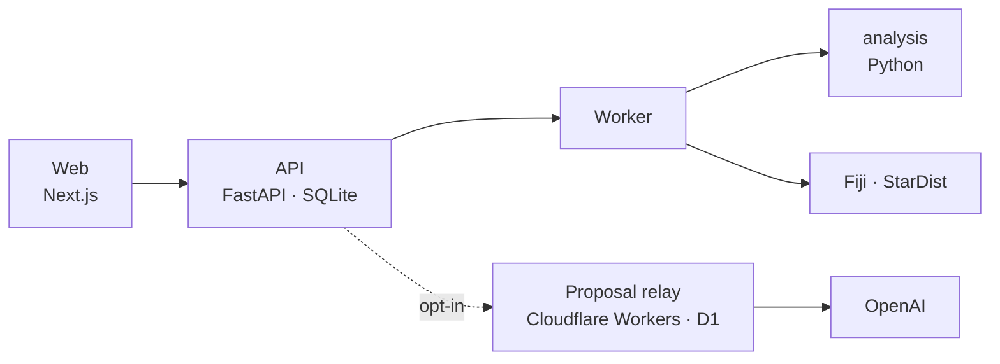

# Cytellect

**Get your microscopy publication-ready.**
蛍光顕微鏡画像の定量から、統計解析、論文用の図まで。

[公開サイト](https://cytellect.vercel.app/) · [解析例](https://cytellect.vercel.app/workspace?demo=bbbc013) · [Windows 版](https://github.com/genellect/cytellect/releases/tag/v0.1.0-local.15) · [研究者向けドキュメント](docs/implementation-overview.ja.md)

Cytellect は、2D 蛍光画像から細胞核と核小体を検出・測定し、実験単位の統計解析と編集可能な図の出力までを一つのワークスペースで行う、生命科学研究者向けのアプリケーションです。Web、Windows ローカル版、Docker の3つの形態で提供しており、いずれも同じ解析コードで動きます。現在は開発中のプロトタイプです。


## アーキテクチャ

画面、API サーバー、解析ワーカーの3層で構成しています。測定値・統計量・図を計算するのはワーカーだけで、API がそれを保存・配信し、画面は保存済みの値を表示します。



- [`apps/web`](apps/web/) は Next.js 16 / React 19 の画面です。API の型は OpenAPI から自動生成しています。Windows 版では、この静的出力を API が配信します。
- [`services/api`](services/api/) は FastAPI のサーバーです。認証、画像の検証、解析の版（revision）とジョブを SQLite で管理します。重い処理は受け付けた時点で `202` を返し、ワーカーに渡します。
- [`services/worker`](services/worker/) は、ジョブを lease 付きで取得し、1ジョブごとに子プロセスで解析を実行します。実行時間とメモリを監視し、上限を超えたジョブはプロセスツリーごと停止します。lease が切れたワーカーは結果を確定できません。
- [`packages/analysis`](packages/analysis/) は、測定・統計・作図・書き出しを実装した Python パッケージです。API とワーカーが同じコードを使います。
- [`engines/fiji`](engines/fiji/) は、核検出に使う Fiji / StarDist / MorphoLibJ の固定版の定義と、Python から呼び出す Java ブリッジです。
- [`services/proposal-worker`](services/proposal-worker/) は、解析計画の提案を OpenAI に中継する Cloudflare Worker です。利用者が有効にしたときだけ使われます。

## 技術スタック

| | |
|---|---|
| Web | Next.js 16 · React 19 · TypeScript 6 |
| API | Python 3.12 · FastAPI · Pydantic 2 · SQLAlchemy 2 · Alembic · SQLite |
| 解析 | NumPy · SciPy · statsmodels · pandas · scikit-image · Matplotlib |
| 画像処理 | Fiji · StarDist 2D · MorphoLibJ |
| 解析計画の提案 | Cloudflare Workers · D1 · OpenAI Responses API |
| 配布 | Vercel · GitHub Releases · Docker Compose |
| テスト | Pytest · Vitest · Playwright · Ruff · mypy · Gitleaks |

## データと再現性

原画像の画素値は変更しません。検出のための正規化は複製に対して行い、検出結果は元画像と同じ座標のラベル画像として保存します。測定は常に元の画素値から行います。

領域の修正や除外は、そのたびに新しい revision として記録し、以前の結果は上書きしません。核を修正すると、その核に含まれる核小体と、そこから作った統計・図は無効になり、再確認の対象になります。

書き出しには、図・全データの CSV・Methods の文案とあわせて、各ファイルの SHA-256 を記録した manifest と再計算用のスクリプトを入れています。図の乱数やメタデータ、アーカイブのタイムスタンプを固定しているため、同じ入力からは同じファイルが生成され、受け取った側で再計算して一致を確かめられます。Fiji、StarDist のモデル、プラグインも版と SHA-256 で固定し、実行のたびに照合します。

## セキュリティ

未発表の研究画像を扱うため、画像と解析結果は利用者の PC か研究室のサーバーから外に出しません。データはリポジトリの外の非公開ディレクトリに置き、最終操作から24時間で削除します。

認証は、招待トークンを `HttpOnly`・`SameSite=Strict` の Cookie に交換する方式で、トークンはハッシュだけを保存します。状態を変える要求では Origin と専用ヘッダーを確認し、他人のワークスペースは存在しないものとして扱います。Windows 版は `127.0.0.1` だけで待ち受けます。Docker ではコンテナを非 root・読み取り専用ルートで動かし、ワーカーはネットワークから切り離しています。

解析計画の提案は、利用者が有効にし、送信のたびに同意した場合だけ動きます。送るのはチャンネルの記号、件数、目的の文だけで、画像や測定値は送りません。モデルの出力は選択肢を固定した JSON Schema に限り、ローカルで検査してから表示します。数値の計算には使いません。費用は、呼び出しの前に最悪の場合の金額を D1 上で月額の上限から予約し、精算されない予約も上限に数え続けます。

## Windows ローカル版

研究室の PC で、管理用のサーバーを用意せずに使えるよう、Windows 版は ZIP を展開して `Cytellect Setup.cmd` を実行するだけで導入できます。セットアップは同梱の manifest を検証したうえで、版とハッシュを固定した Python、依存パッケージ、Fiji を `%LOCALAPPDATA%\Cytellect` に導入します。システムの Python、PATH、既存の Fiji には触れません。ネットワークを使うのはこの導入時だけで、解析中に依存を取得することはありません。

起動するとランチャーが API とワーカーを立ち上げ、ブラウザで画面を開きます。サーバーは `127.0.0.1` だけで待ち受け、セッションはローカル専用の手順で確立するため、招待トークンの入力はいりません。

アプリケーションは版ごとに別のディレクトリに入れ、Fiji と Python の実行環境は構成が変わらない限り共有します。更新時は新しい版が起動確認と Fiji の数値確認を通るまで古い版を残し、その後に、記録と一致する古い版だけを削除します。研究データの領域は削除の対象にしません。

## 品質保証

`main` に入るには、次の5つの CI ジョブがすべて通る必要があります。

- `python`：Ruff、mypy、Fiji を使わない全テスト。統計の計算は、閉形式の解やすべての並べ替えを数え上げた値と照合しています。あわせて、全履歴の秘密情報スキャン、依存の監査、SBOM の生成を行います。
- `web`：OpenAPI と TypeScript 型を再生成して差分がないことを確認し、型検査、単体テスト、ビルド、公開サイトのブラウザ試験を行います。
- `fiji-browser`：実際の Fiji で公開画像を解析し、ImageJ で独立に計算した値と照合します。実 API に対するブラウザ試験と、ネットワークなし・読み取り専用のコンテナでの Fiji 実行もここで確認します。
- `local-windows`、`python-windows-314`：Windows でのセットアップ、起動・終了、Python 3.14 での全テスト。

Windows 版は別のワークフローで、配布する ZIP そのものをクリーンな環境に導入し、ブラウザ試験26件と、書き出しからの再計算照合を通した版だけを公開します。

## 開発環境

Python 3.12、Node.js 24、pnpm 11.19.0、uv を使います。

```bash
uv sync --locked --dev
pnpm install --frozen-lockfile
uv run python scripts/fiji_setup.py ~/cytellect-fiji --platform linux-x64

export CYTELLECT_DATA_DIR=~/cytellect-data
export CYTELLECT_FIJI_EXECUTABLE=~/cytellect-fiji
export CYTELLECT_SECURE_COOKIES=false

uv run cytellect invite --hours 24   # 招待トークンを発行
uv run cytellect serve               # API
uv run cytellect-worker              # Worker
pnpm dev                             # Web（http://localhost:3000）
```

テストは `uv run pytest` と `pnpm test`、静的検査は `uv run ruff check .` と `pnpm check` で実行します。

## ドキュメント

研究者向けの機能と解析法の説明は [docs/implementation-overview.ja.md](docs/implementation-overview.ja.md) にあります。設計・運用の資料は [docs/](docs/) にまとめています。

## ライセンス

[Apache License 2.0](LICENSE)。Fiji、モデルの重み、公開データセットには、それぞれのライセンスが適用されます（[OSS 一覧](docs/oss.md)）。脆弱性は [SECURITY.md](SECURITY.md) の窓口から報告してください。
