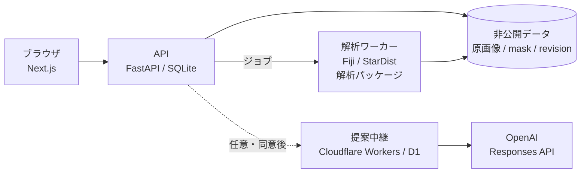

<div align="center">


# Cytellect

**蛍光顕微鏡画像の核内定量から、実験単位の統計、論文用の図まで。**

[公開サイト](https://cytellect.vercel.app/) · [解析例](https://cytellect.vercel.app/workspace?demo=bbbc013) · [Windows版](https://github.com/genellect/cytellect/releases/tag/v0.1.0-local.15) · [研究者向けの機能説明](docs/implementation-overview.ja.md) · [English](README.en.md)

</div>

---

## 概要

Cytellect は、2次元の蛍光画像から細胞核と核小体を検出し、核ごとの面積と輝度を測定して、独立した実験単位を n とする群間比較と、編集可能な論文用の図を出力するアプリケーションです。

画像処理は固定版の Fiji / StarDist、測定・統計・作図は Python の解析パッケージが担当します。ブラウザは表示と操作だけを行い、数値はすべてサーバー側で計算・保存します。原画像の画素値は変更せず、検出・修正・除外は不変の版として記録します。書き出した一式からは、同じ測定値・統計量・図を再計算して照合できます。

> **研究用プロトタイプです。** 計算は公開画像と独立した数値参照で検証済みです。核・核小体の検出精度の独立評価、非公開の研究画像での妥当性、研究者による利用評価は未完了です（[ロードマップ](docs/roadmap.md)）。

## 実装の範囲

| 分野 | 実装 |
|---|---|
| 画像入力 | 2D TIFF / OME-TIFF、8・16 bit。軸・寸法・plane の厳密検証。欠損 plane の補完や外部参照 OME は拒否 |
| 核検出 | Fiji StarDist 2D 0.3.0（Versatile fluorescent nuclei）。Fiji・モデル・プラグインを SHA-256 で固定し、実行前に照合 |
| 核小体 | 核ごとの NCL Otsu しきい値、または DAPI 低輝度領域。MorphoLibJ による連結成分ラベリング |
| 測定 | 面積（px・µm²）、平均・中央値・積分輝度（背景補正前後）、核小体数・面積割合、核質/核小体比、飽和率 |
| 修正 | 追加・削除・結合・分割・除外（理由必須）。修正ごとに不変の revision を作成し、親子関係（核→核小体）を無効化 |
| 統計 | Welch t、対応 t、Mann–Whitney U、Wilcoxon、Welch ANOVA、Kruskal–Wallis、Pearson、Spearman。Holm 補正。小標本は全列挙の正確検定 |
| 作図 | SuperPlot 型の群比較、箱ひげ、バイオリン、ヒストグラム、対応線、散布図、視野別分布。SVG（文字編集可）/ PDF（書体埋め込み）/ PNG |
| 再現性 | レシピ・測定規約・統計・描画の版番号を記録。成果物に SHA-256 manifest と replay スクリプトを同梱 |
| 解析案（任意） | 目的文から測定・検定・図の組み合わせを LLM が提案。閉じた選択肢の構造化出力と、ローカルの科学的検査を経て表示。既定は無効 |

## 統計設計

細胞は独立な観測ではないため、Cytellect は細胞数ではなく独立した実験単位を n とします。

```text
細胞 ──(中央値)──▶ 視野 ──(平均)──▶ 試料 ──(平均)──▶ 実験単位 = n
```

| 方針 | 実装 |
|---|---|
| 擬似反復の防止 | 集計規則 `field-median_sample-mean_unit-mean-v1` を結果に記録。視野の条件またぎ、対応なし比較での単位重複、欠けた対応組を拒否 |
| 手法の選択 | 正規性検定による手法の切り替えはしない。デザインと矛盾する組み合わせは契約で拒否 |
| 欠測 | 0 で置き換えない。理由付きの欠測として台帳に残し、単位レベルは complete-case |
| 正確性 | 閉形式解、全並べ替え列挙、独立実装のサンドイッチ推定量と照合するテストで固定 |
| 根拠 | 帰無仮説下の模擬実験で、細胞単位の回帰（視野クラスタ誤差）は第1種の過誤 32%、実験単位の検定は 2.8%（`scripts/exploratory_model_null_simulation.py`） |

詳細は [statistics.md](docs/statistics.md)、[common-statistics.md](docs/common-statistics.md)、[region-comparisons.md](docs/region-comparisons.md) を参照してください。

## アーキテクチャ



| 配布形態 | 内容 |
|---|---|
| Web（Vercel） | 公開サイト、解析計画、公開画像の解析例。研究画像の解析サーバーは持たない |
| Windows 版 | PC 内で API・ワーカー・Fiji を起動。固定版の Python と依存を検証付きで導入し、システムの Python・PATH・既存 Fiji は変更しない |
| Docker | API・ワーカー・Web の3コンテナ。UID 10001、読み取り専用ルート、ワーカーはネットワークなし |

ワーカーは外部ネットワークを必要としません。解析案の中継は API からだけ接続し、画素・測定値・ファイル名は送信しません。

## 技術スタック

| 領域 | 技術 |
|---|---|
| Web | Next.js 16 · React 19 · TypeScript 6 · CSS Modules · Static Export（Windows 版） |
| API | Python 3.12 · FastAPI · Pydantic 2 · SQLAlchemy 2 · Alembic · SQLite |
| 画像処理 | Fiji · StarDist 2D 0.3.0 · TensorFlow 1.15（Java）· MorphoLibJ 1.6.5 · tifffile · scikit-image |
| 統計・作図 | NumPy · SciPy · statsmodels · pandas · Matplotlib · roifile |
| 解析案 | Cloudflare Workers · D1 · OpenAI Responses API（Structured Outputs, `store: false`） |
| 配布 | Vercel · Windows ZIP（GitHub Releases）· Docker Compose |
| 検証 | Pytest · Vitest · Playwright · Ruff · mypy · Gitleaks · pnpm audit · CycloneDX SBOM |
| 開発環境 | uv · pnpm · Codex Cloud · Claude Code |

## テストと CI

必須チェックは5つです。すべて通過したコミットだけを `main` に統合し、Vercel と Windows 版の公開に進みます。

| ジョブ | 内容 |
|---|---|
| `python` | Ruff、mypy、Fiji を使わない全テスト、公開ツリー・文書リンク検査、全履歴の秘密情報スキャン、依存監査と SBOM |
| `web` | OpenAPI と TypeScript 型の再生成差分、型検査、単体テスト、ビルド、公開サイトのブラウザ試験 |
| `fiji-browser` | 実 Fiji での解析、公開画像 BBBC007 の ImageJ 独立計算との照合、実 API に対するブラウザ試験、オフライン・読み取り専用コンテナでの Fiji 実行 |
| `local-windows` | Windows でのセットアップ・起動・終了の境界試験 |
| `python-windows-314` | Windows / Python 3.14 での全テスト |

Windows 版はこれとは別に、配布 ZIP そのものをクリーン環境に導入し、26 のブラウザ試験と数値の再計算照合に通ったものだけを公開します（[受入記録](docs/local-release-0.1.0.md)）。

| 検証 | 結果 |
|---|---|
| 測定値 | BBBC007・BBBC013・4DN で ImageJ と一致（面積・平均・中央値は完全一致） |
| 核検出 | BBBC039 で F1 0.92（学習データと重複するため独立評価ではない） |
| 統計 | 閉形式解・全列挙との一致 |
| 再現性 | 書き出し一式からの再計算で、測定値・統計量・図が一致 |

## 開発を始める

Python 3.12、Node.js 24、pnpm 11.19.0、uv 0.12.2 を使用します。

```sh
uv sync --locked --dev
pnpm install --frozen-lockfile

# データは checkout の外の非公開ディレクトリに置く
export CYTELLECT_DATA_DIR=/absolute/private/cytellect
export CYTELLECT_APP_ORIGIN=http://localhost:3000
export CYTELLECT_SECURE_COOKIES=false
uv run python scripts/fiji_setup.py /absolute/private/fiji --platform linux-x64
export CYTELLECT_FIJI_EXECUTABLE=/absolute/private/fiji

uv run cytellect invite --hours 24   # 招待コードはログや Issue に貼らない
uv run cytellect serve               # API
uv run cytellect-worker              # 解析ワーカー
pnpm dev                             # Web
```

変更後の確認：

```sh
uv run ruff check . && uv run pytest
pnpm check && pnpm test
```

Docker は `CYTELLECT_RUNTIME_DIR` に UID 10001 所有の非公開ディレクトリを指定して `docker compose up --build -d` で起動します。Windows の Docker Desktop 用手順は [docker-desktop.md](docs/docker-desktop.md) にあります。

## リポジトリ構成

| パス | 内容 |
|---|---|
| [`apps/web/`](apps/web/) | Next.js の画面。公開サイト、解析計画、ワークスペース、Playwright 試験 |
| [`services/api/`](services/api/) | FastAPI、認証、ワークスペース・revision・ジョブ管理、マイグレーション |
| [`services/worker/`](services/worker/) | ジョブ実行、Fiji 呼び出し、測定・統計・作図の実行 |
| [`packages/analysis/`](packages/analysis/) | 測定・統計・作図・書き出し・replay の共通実装と契約 |
| [`packages/contracts/`](packages/contracts/) | OpenAPI と生成済みの TypeScript 型 |
| [`services/proposal-worker/`](services/proposal-worker/) | 解析案の中継（Cloudflare Workers + D1） |
| [`engines/`](engines/) | Fiji・モデル・Windows 実行環境の固定版とハッシュ |
| [`fixtures/public/`](fixtures/public/) | 出典・ライセンス・ハッシュを記録した公開画像 |
| [`tests/`](tests/) | Python の単体・数値参照・統合・受入試験 |
| [`scripts/`](scripts/) | セットアップ、配布物の作成、受入試験、検証スクリプト |

## ドキュメント

| 文書 | 内容 |
|---|---|
| [implementation-overview.ja.md](docs/implementation-overview.ja.md) | 研究者向けの機能説明 |
| [requirements.md](docs/requirements.md) | 要件と受入条件 |
| [methods.md](docs/methods.md) | 測定と解析の定義 |
| [statistics.md](docs/statistics.md) / [common-statistics.md](docs/common-statistics.md) | 統計手法と版 |
| [figures.md](docs/figures.md) | 作図と書き出し |
| [validation.md](docs/validation.md) / [public-validation.md](docs/public-validation.md) | 検証の範囲と結果 |
| [security.md](docs/security.md) | 研究データの保護と運用 |
| [local.md](docs/local.md) | Windows 版の構成と制約 |
| [proposal-service.md](docs/proposal-service.md) | 解析案の契約・検証・中継 |
| [roadmap.md](docs/roadmap.md) | 未完了の要件 |

## 研究データとライセンス

非公開の研究画像、試料名、条件、解析結果は、GitHub・CI・外部 AI・公開デモに含めません。公開デモと統合試験には、出典と再配布条件を記録した公開画像だけを使います。運用上の扱いは [security.md](docs/security.md) に定めています。

本リポジトリのソースコードは Apache License 2.0 です。Fiji、モデルの重み、公開データセットなど第三者の成果物には、それぞれのライセンスが適用されます（[OSS 一覧](docs/oss.md)）。貢献の手順は [CONTRIBUTING.md](CONTRIBUTING.md)、脆弱性の報告は [SECURITY.md](SECURITY.md) を参照してください。
