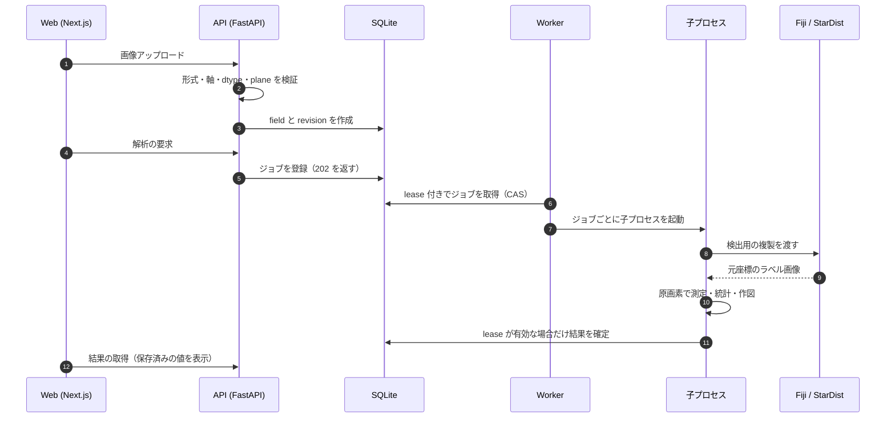

# Cytellect

蛍光顕微鏡画像から細胞核を検出・測定し、実験単位の統計と論文用の図を出力するアプリケーション。
Web（Vercel）、Windows ローカル版、Docker の3形態で、同じ解析実装を配布しています。

研究用プロトタイプです。研究画像での妥当性確認と利用者評価は未完了です（[roadmap](docs/roadmap.md)）。

利用者・研究者向けの説明は [解析機能の説明](docs/implementation-overview.ja.md) にあります。このREADMEは開発者向けです。 · [English](README.en.md)

---

## 何が難しいか

このリポジトリの設計は、次の4つの制約から決まっています。

1. **数値の正しさを後から検証できること**：測定値・統計量・図は論文の根拠になる。同じ入力から同じバイト列を出し、第三者が再計算して照合できる必要がある。
2. **研究データを外に出さないこと**：未発表の画像を扱う。ネットワーク、ログ、CI、外部 AI のどこにも漏らさない。
3. **ネイティブの画像処理エンジンを安全に使うこと**：Fiji / StarDist（Java・TensorFlow）を、版を固定したまま、隔離されたプロセスで実行する。
4. **LLM を判断に使わないこと**：解析計画の提案にだけ LLM を使い、数値や結論には関与させない。

## 1つの解析がたどる経路



ブラウザは計算しません。表示している数値は、すべてサーバーに保存された値です。

## 保証していること

| 保証 | 実装している場所 | 検証 |
|---|---|---|
| 原画像の画素を変更しない | 検出は複製に対して実行。測定は原画素を読む | ImageJ による独立計算との一致（公開画像3種） |
| 結果を上書きしない | 修正・除外・背景変更のたびに不変の revision を作成。親の変更で子と派生結果を無効化 | revision と無効化の API テスト |
| 古いワーカーが結果を書かない | SQLite 上の CAS による lease。期限切れの lease では確定できない | lease の fencing と再試行のテスト |
| 同じ入力から同じ出力 | 乱数 seed、SVG hashsalt、メタデータ、zip のタイムスタンプを固定 | replay での再生成・照合 |
| 書き出し後に再現できる | SHA-256 manifest と `replay.py` を同梱し、測定・統計・図を再計算して照合 | replay の受入試験（Windows 版・Docker） |
| API と画面の型がずれない | Pydantic → OpenAPI → TypeScript を自動生成 | CI で再生成し、差分があれば失敗 |
| 外部エンジンが差し替わらない | Fiji・モデル・プラグインを SHA-256 で固定し、実行前に照合。実行時のダウンロードなし | 実 Fiji を使う CI ジョブ（`fiji-browser`） |
| 計算できない値を 0 にしない | `null` と理由コードで返す | 欠測理由のテスト |

## 信頼境界

| 境界 | 想定する脅威 | 対策 |
|---|---|---|
| ブラウザ → API | なりすまし、CSRF、他人のデータの参照 | 招待トークンを `HttpOnly`・`SameSite=Strict` の Cookie に交換し、トークンは SHA-256 だけを保存。変更系の要求で Origin と `X-Cytellect-Request` を検証。所有者以外には 404 |
| アップロード | 不正な画像、巨大な入力、外部参照 | 軸・寸法・dtype・plane の厳密な検証、容量の上限。リモート URL・任意コード・マクロは受け付けない |
| API → ワーカー | 暴走・ハング、ネットワーク経由の漏洩 | ジョブごとの子プロセスと、時間・メモリの監視（超過時はプロセスツリーごと停止）。コンテナでは `network_mode: none` |
| コンテナ | 権限昇格 | UID 10001、読み取り専用ルート、`cap_drop: ALL`、`no-new-privileges`、127.0.0.1 だけに公開 |
| API → 提案中継 → OpenAI | 研究データの送信、費用の暴走、誘導 | 既定で無効。送信ごとの同意（なければ `428`）。送るのは記号・件数・目的文だけ。リダイレクトの拒否、`store: false`、本文をログに残さない。D1 で最悪の費用を予約し、精算されない予約も上限に数える |
| LLM の出力 → 解析 | 誤った手法や染色名の採用 | 閉じた enum の JSON Schema で出力させ、ローカルで意味検査。採用は人が行い、数値は LLM の外で計算 |
| リポジトリ → CI | 秘密情報・研究データの混入、依存の汚染 | Gitleaks による全履歴スキャン、公開ツリーの検査、lockfile とハッシュによる固定、`pnpm audit`、CycloneDX SBOM |
| 保存データ | 長期の残留 | リポジトリ外の非公開ディレクトリに置き、最終操作から24時間で削除 |

詳細は [security.md](docs/security.md) と [proposal-service.md](docs/proposal-service.md) を参照してください。

## 動かす

Python 3.12、Node.js 24、pnpm 11.19.0、uv 0.12.2 が必要です。

```sh
uv sync --locked --dev && pnpm install --frozen-lockfile

export CYTELLECT_DATA_DIR=/absolute/private/cytellect      # リポジトリの外に置く
export CYTELLECT_APP_ORIGIN=http://localhost:3000
export CYTELLECT_SECURE_COOKIES=false
uv run python scripts/fiji_setup.py /absolute/private/fiji --platform linux-x64
export CYTELLECT_FIJI_EXECUTABLE=/absolute/private/fiji

uv run cytellect invite --hours 24    # 招待トークン（ログに残さない）
uv run cytellect serve                # API
uv run cytellect-worker               # Worker
pnpm dev                              # Web
```

確認：`uv run ruff check . && uv run pytest`、`pnpm check && pnpm test`

Docker は `CYTELLECT_RUNTIME_DIR` に UID 10001 所有のディレクトリを指定して `docker compose up --build -d`。Windows の Docker Desktop は [docker-desktop.md](docs/docker-desktop.md) を参照してください。

## コードを読む順番

| 知りたいこと | 読む場所 |
|---|---|
| API の入口と認証 | [`services/api/src/cytellect_api/app.py`](services/api/src/cytellect_api/app.py) |
| ジョブの lease と状態 | [`services/api/src/cytellect_api/db.py`](services/api/src/cytellect_api/db.py) |
| 子プロセスの監視 | [`services/worker/src/cytellect_worker/supervision.py`](services/worker/src/cytellect_worker/supervision.py) |
| 画像の読み込みと検証 | [`packages/analysis/src/cytellect_analysis/images.py`](packages/analysis/src/cytellect_analysis/images.py) |
| Fiji との受け渡し | [`engines/fiji/CytellectEngine.java`](engines/fiji/CytellectEngine.java)、[`engine.py`](packages/analysis/src/cytellect_analysis/engine.py) |
| 書き出しと replay | [`region_exports.py`](packages/analysis/src/cytellect_analysis/region_exports.py) |
| 提案中継と予算 | [`services/proposal-worker/src/`](services/proposal-worker/src/) |
| 生成される型 | [`packages/contracts/`](packages/contracts/) |

## CI と公開

`main` に入るには5つの必須チェック（`python`、`web`、`fiji-browser`、`local-windows`、`python-windows-314`）の通過が必要です。`fiji-browser` は実 Fiji とブラウザで公開画像を解析し、ImageJ の独立計算と照合します。

| 形態 | 公開の条件 |
|---|---|
| Web | `main` の更新で Vercel が自動で公開。研究画像の解析サーバーは持たない |
| Windows 版 | 配布 ZIP をクリーン環境に導入し、26 のブラウザ試験と replay 照合に通った版だけを GitHub Releases に公開（[受入記録](docs/local-release-0.1.0.md)） |
| Docker | 全体の受入試験（実 Fiji、replay）を通したソースから構築 |
| 提案中継 | 予算0・キーなしで公開済み。有料呼び出しの有効化は所有者の承認後 |

## 技術スタック

Next.js 16 · React 19 · TypeScript 6 / Python 3.12 · FastAPI · Pydantic 2 · SQLAlchemy 2 · Alembic · SQLite / NumPy · SciPy · statsmodels · scikit-image · Matplotlib / Fiji · StarDist 2D 0.3.0 · MorphoLibJ / Cloudflare Workers · D1 · OpenAI Responses API / Vercel · Docker Compose / Pytest · Vitest · Playwright · Ruff · mypy · Gitleaks

依存とライセンスの一覧は [oss.md](docs/oss.md) にあります。

## 関連資料

[architecture.md](docs/architecture.md)（構成） · [security.md](docs/security.md)（データ保護） · [local.md](docs/local.md)（Windows 版） · [fiji.md](docs/fiji.md)（エンジンの固定） · [deployment.md](docs/deployment.md)（Web の公開） · [proposal-deployment.md](docs/proposal-deployment.md)（中継の公開） · [requirements.md](docs/requirements.md)（要件）

## ライセンス

ソースコードは Apache License 2.0。Fiji、モデルの重み、公開データセットには、それぞれのライセンスが適用されます。[CONTRIBUTING.md](CONTRIBUTING.md) · [SECURITY.md](SECURITY.md)
