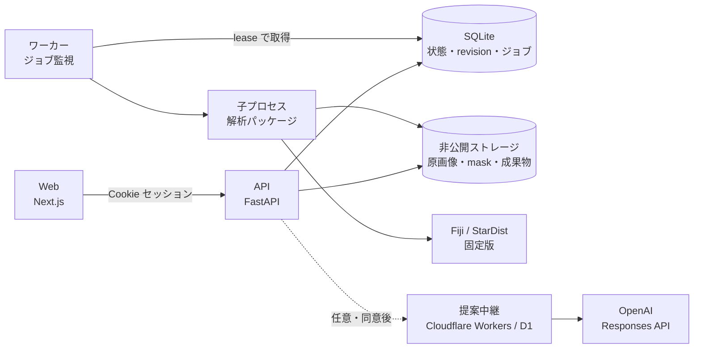

<div align="center">


# Cytellect

**蛍光顕微鏡画像の核内定量から、実験単位の統計、論文用の図まで。**

[公開サイト](https://cytellect.vercel.app/) · [解析例](https://cytellect.vercel.app/workspace?demo=bbbc013) · [Windows版](https://github.com/genellect/cytellect/releases/tag/v0.1.0-local.15) · [English](README.en.md)

</div>

---

## 資料の入口

| 読者 | 資料 |
|---|---|
| 研究者（利用者） | [解析機能の説明](docs/implementation-overview.ja.md) · [公開画像ではじめる](docs/quickstart.ja.md) · [解析法](docs/methods.md) · [検証結果](docs/validation.md) |
| エンジニア | このREADME · [アーキテクチャ](docs/architecture.md) · [セキュリティ](docs/security.md) · [ローカル配布](docs/local.md) · [解析案サービス](docs/proposal-service.md) |

## 概要

Cytellect は、2次元の蛍光画像から細胞核を検出・測定し、群間比較と論文用の図を出力するアプリケーションです。

ブラウザ、API、解析ワーカーの3層で構成されます。測定値・統計量・図はすべてワーカーが計算してサーバー側に保存し、ブラウザは表示と操作だけを担います。画像処理は版とハッシュを固定した Fiji を外部プロセスとして実行し、測定・統計・作図は API とワーカーが共有する Python パッケージで行います。

同じ実装を、公開 Web（Vercel）、Windows のローカル版、Docker の3つの形態で配布しています。

> **研究用プロトタイプです。** 本番運用の前提となる外部監査、研究画像での妥当性確認、利用者評価は未完了です（[ロードマップ](docs/roadmap.md)）。

## アーキテクチャ



| コンポーネント | 責務 |
|---|---|
| Web | Next.js 16 / React 19。数値を計算しない。OpenAPI から生成した型で API を呼ぶ。Windows 版では静的出力を API が配信する |
| API | 認証、所有権の判定、入力検証、revision とジョブの作成、成果物の配信。重い処理は受け付けて `202` を返す |
| ワーカー | ジョブを lease 付きで取得し、ジョブごとに子プロセスを起動。時間・メモリの上限を監視し、超過時は子プロセスごと停止する |
| 解析パッケージ | 画像読み込み、測定、統計、作図、書き出し、replay。API とワーカーで同じコードを使う |
| Fiji ブリッジ | ヘッドレス Fiji 上の Java ブリッジ。検出用の複製を受け取り、元座標のラベル画像を返す |
| 提案中継 | 解析計画の提案を外部 LLM に求める任意機能。既定で無効。API からだけ接続する |

## 設計の要点

| 項目 | 設計 |
|---|---|
| 数値の所在 | 測定・統計・図はサーバー側だけで計算する。ブラウザの表示値は保存済みの値の写し |
| 不変の revision | 検出・修正・除外・背景変更のたびに新しい revision を作成し、既存の結果を上書きしない。親（核）の変更で子（核小体）と派生結果を無効化する依存関係を持つ |
| ジョブ | SQLite 上の CAS（compare-and-swap）による lease で取得し、期限切れの古いワーカーが結果を書き込めないようにする。取り消し・再試行に対応 |
| 契約と型 | Pydantic のモデルから OpenAPI を生成し、TypeScript 型を自動生成。CI で再生成し、差分があれば失敗させる |
| 版管理 | レシピ、測定規約、統計手法、図の描画処理、解析案のプロトコルに版番号を持たせ、結果に記録する |
| 決定性 | 図の乱数 seed、SVG の hashsalt、メタデータ、zip のタイムスタンプを固定し、同じ入力から同じバイト列を生成する |
| replay | 書き出し一式に SHA-256 の manifest と再計算スクリプトを同梱し、測定・統計・図を再計算して一致を検査する |
| 外部エンジンの固定 | Fiji、StarDist、モデル、プラグインを版と SHA-256 で固定し、実行前に毎回照合する。実行時のダウンロードは行わない |
| 欠測 | 計算できない値は `null` と理由コードで返し、0 で置き換えない |

## セキュリティ

研究画像と解析結果は非公開データとして扱います。運用上の詳細は [security.md](docs/security.md) にあります。

| 領域 | 対策 |
|---|---|
| 認証 | 招待トークンをセッション Cookie（`HttpOnly`・`SameSite=Strict`、本番は `Secure`）に交換。トークンは SHA-256 のダイジェストだけを保存する |
| CSRF | 状態を変える要求で Origin と専用ヘッダー `X-Cytellect-Request` を検証する |
| 認可 | ワークスペースの所有者だけが読み書きできる。他人のリソースは存在しないもの（404）として扱う |
| 入力 | 形式・寸法・dtype・plane を厳密に検証し、アップロード量とワークスペース容量に上限を設ける。リモート URL・任意コード・マクロは受け付けない |
| データの保管 | データはリポジトリの外の非公開ディレクトリに置き、最終操作から24時間で削除する |
| コンテナ | UID 10001、読み取り専用ルート、`cap_drop: ALL`、`no-new-privileges`。ワーカーは `network_mode: none`、メモリ・プロセス数の上限付き。ポートは 127.0.0.1 にだけ公開する |
| ローカル版 | ループバックだけで待ち受け、PC 外から接続できない。システムの Python・PATH・既存の Fiji を変更しない |
| 解析案の送信 | 既定で無効。送信のたびに同意（なければ `428`）。送るのはチャンネルの記号・件数・目的文だけで、画素・測定値・ファイル名は送らない。リダイレクトを拒否し、OpenAI には `store: false` で送信、本文はログに残さない |
| 解析案の費用 | 招待制の端末トークンと月間の回数上限。D1 上で最悪の費用を1つの SQL 文で予約し、精算されない予約も上限に数え続ける |
| サプライチェーン | 依存は lockfile とハッシュで固定。Gitleaks による全履歴の秘密情報スキャン、`pnpm audit`、Python 依存の監査と CycloneDX SBOM を CI で実行する |
| 公開物 | 公開デモと試験には、出典・再配布条件・ハッシュを記録した公開画像だけを使う。非公開の研究データを Git、CI、外部 AI に入れない |

## 技術スタック

| 領域 | 技術 |
|---|---|
| Web | Next.js 16 · React 19 · TypeScript 6 · CSS Modules · Static Export |
| API | Python 3.12 · FastAPI · Pydantic 2 · SQLAlchemy 2 · Alembic · SQLite · Uvicorn |
| 解析 | NumPy · SciPy · statsmodels · pandas · scikit-image · tifffile · Matplotlib · roifile |
| 画像処理エンジン | Fiji · StarDist 2D 0.3.0 · TensorFlow 1.15（Java）· MorphoLibJ 1.6.5 |
| 解析案 | Cloudflare Workers · D1 · OpenAI Responses API（Structured Outputs） |
| 配布 | Vercel · Windows ZIP（GitHub Releases）· Docker Compose |
| 品質 | Pytest · Vitest · Playwright · Ruff · mypy · Gitleaks · pnpm audit · CycloneDX |
| ツール | uv 0.12.2 · pnpm 11.19.0 · Node.js 24 |

## テストと CI

`main` への統合には、次の5つの必須チェックの通過が必要です。`main` の更新で Vercel の本番が更新されます。

| ジョブ | 内容 |
|---|---|
| `python` | Ruff、mypy、Fiji を使わない全テスト、公開ツリーと文書リンクの検査、全履歴の秘密情報スキャン、依存監査と SBOM |
| `web` | OpenAPI と TypeScript 型の再生成差分、型検査、単体テスト、ビルド、公開サイトのブラウザ試験 |
| `fiji-browser` | 実 Fiji での解析、公開画像を使った ImageJ との数値照合、実 API に対するブラウザ試験、オフライン・読み取り専用コンテナでの Fiji 実行 |
| `local-windows` | Windows でのセットアップと、起動・終了の境界試験 |
| `python-windows-314` | Windows / Python 3.14 での全テスト |

Windows 版は別のワークフローで配布用 ZIP そのものをクリーン環境に導入し、26 のブラウザ試験と数値の再計算照合に通った版だけを公開します（[受入記録](docs/local-release-0.1.0.md)）。

## 開発を始める

Python 3.12、Node.js 24、pnpm 11.19.0、uv 0.12.2 を使用します。

```sh
uv sync --locked --dev
pnpm install --frozen-lockfile

# データはリポジトリの外の非公開ディレクトリに置く
export CYTELLECT_DATA_DIR=/absolute/private/cytellect
export CYTELLECT_APP_ORIGIN=http://localhost:3000
export CYTELLECT_SECURE_COOKIES=false
uv run python scripts/fiji_setup.py /absolute/private/fiji --platform linux-x64
export CYTELLECT_FIJI_EXECUTABLE=/absolute/private/fiji

uv run cytellect invite --hours 24   # 招待トークンはログや Issue に貼らない
uv run cytellect serve               # API
uv run cytellect-worker              # ワーカー
pnpm dev                             # Web
```

変更後の確認：

```sh
uv run ruff check . && uv run pytest
pnpm check && pnpm test
```

Docker は `CYTELLECT_RUNTIME_DIR` に UID 10001 所有の非公開ディレクトリを指定し、`docker compose up --build -d` で起動します。Docker Desktop の手順は [docker-desktop.md](docs/docker-desktop.md) にあります。

## リポジトリ構成

| パス | 内容 |
|---|---|
| [`apps/web/`](apps/web/) | Next.js の画面と Playwright 試験 |
| [`services/api/`](services/api/) | FastAPI、認証、revision・ジョブ管理、マイグレーション |
| [`services/worker/`](services/worker/) | ジョブ監視、子プロセス実行、Fiji 呼び出し |
| [`packages/analysis/`](packages/analysis/) | 測定・統計・作図・書き出し・replay と各契約 |
| [`packages/contracts/`](packages/contracts/) | OpenAPI と生成済みの TypeScript 型 |
| [`services/proposal-worker/`](services/proposal-worker/) | 解析案の中継（Cloudflare Workers + D1） |
| [`engines/`](engines/) | Fiji・モデル・Windows 実行環境の固定版とハッシュ |
| [`infra/`](infra/) · [`compose.yaml`](compose.yaml) | コンテナ定義 |
| [`fixtures/public/`](fixtures/public/) | 出典とハッシュを記録した公開画像 |
| [`tests/`](tests/) · [`scripts/`](scripts/) | Python の試験、セットアップ、配布物の作成と受入試験 |

## エンジニア向け資料

| 文書 | 内容 |
|---|---|
| [architecture.md](docs/architecture.md) | 構成と責務の境界 |
| [security.md](docs/security.md) | 研究データの保護、認証、運用 |
| [local.md](docs/local.md) · [windows-runtime.md](docs/windows-runtime.md) | Windows 版の構成、導入、保持期間 |
| [deployment.md](docs/deployment.md) | Web の公開手順 |
| [docker-desktop.md](docs/docker-desktop.md) | Docker Desktop での起動 |
| [proposal-service.md](docs/proposal-service.md) · [proposal-deployment.md](docs/proposal-deployment.md) | 解析案の契約・検証・中継と公開手順 |
| [fiji.md](docs/fiji.md) | 画像処理エンジンの固定と検証 |
| [requirements.md](docs/requirements.md) · [roadmap.md](docs/roadmap.md) | 要件と未完了の項目 |
| [oss.md](docs/oss.md) | 依存ソフトウェアとライセンス |

## ライセンス

本リポジトリのソースコードは Apache License 2.0 です。Fiji、モデルの重み、公開データセットなど第三者の成果物には、それぞれのライセンスが適用されます（[OSS 一覧](docs/oss.md)）。貢献の手順は [CONTRIBUTING.md](CONTRIBUTING.md)、脆弱性の報告は [SECURITY.md](SECURITY.md) を参照してください。
