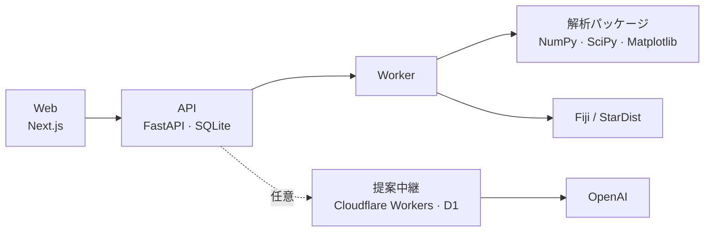

# Cytellect

[](https://github.com/genellect/cytellect/actions/workflows/ci.yml)
[](LICENSE)


蛍光顕微鏡画像から核を検出・測定し、実験単位の統計と論文用の図までを1つのワークスペースで行う解析アプリケーション。

[公開サイト](https://cytellect.vercel.app/) · [解析例](https://cytellect.vercel.app/workspace?demo=bbbc013) · [Windows 版](https://github.com/genellect/cytellect/releases/tag/v0.1.0-local.15) · [研究者向けの説明](docs/implementation-overview.ja.md) · [English](README.en.md)


## 特徴

- Fiji / StarDist による核検出を、版と SHA-256 を固定した別プロセスで実行する。解析ワーカーはネットワークから切り離して動く
- 測定値は公開画像で ImageJ の独立計算と一致する（4DN の 482 領域で面積・平均・中央値が完全一致）
- 細胞ではなく独立した実験単位を n とする階層集計。小標本ではすべての並べ方を数え上げる正確検定を使う
- 修正や除外はすべて不変の revision として残り、図や統計は依存関係に沿って無効化・再計算される
- 書き出しは決定的なバイト列で、SHA-256 manifest と replay スクリプトにより第三者が再計算・照合できる
- LLM は閉じたスキーマで解析計画を提案するだけで、出力はローカルで検証され、数値の計算には関与しない
- 同じ解析コードを Web、Windows ローカル版、Docker の3形態で配布している

## 構成



ブラウザは表示と操作だけを担い、測定・統計・作図はワーカーが行う。API とワーカーは同じ Python パッケージを使い、型は OpenAPI から TypeScript へ自動生成している。

| 層 | 技術 |
|---|---|
| Web | Next.js 16 · React 19 · TypeScript |
| API | FastAPI · Pydantic · SQLAlchemy · Alembic · SQLite |
| 解析 | Fiji · StarDist 2D · MorphoLibJ · NumPy · SciPy · statsmodels · scikit-image · Matplotlib |
| 提案中継 | Cloudflare Workers · D1 · OpenAI Responses API |
| 配布・検証 | Vercel · GitHub Actions · Docker Compose · Pytest · Vitest · Playwright |

## はじめる

試すだけなら[公開サイトの解析例](https://cytellect.vercel.app/workspace?demo=bbbc013)を開くか、[Windows 版](https://github.com/genellect/cytellect/releases/tag/v0.1.0-local.15)を展開して `Cytellect Setup.cmd` を実行する。

開発環境（Python 3.12、Node.js 24、pnpm 11.19.0、uv）：

```sh
uv sync --locked --dev && pnpm install --frozen-lockfile
uv run python scripts/fiji_setup.py ~/cytellect-fiji --platform linux-x64

export CYTELLECT_DATA_DIR=~/cytellect-data CYTELLECT_FIJI_EXECUTABLE=~/cytellect-fiji CYTELLECT_SECURE_COOKIES=false
uv run cytellect invite --hours 24      # 招待トークンを発行
uv run cytellect serve & uv run cytellect-worker & pnpm dev
```

http://localhost:3000 で招待トークンを入力する。Docker での起動は [docker-desktop.md](docs/docker-desktop.md) を参照。

## ドキュメント

| | |
|---|---|
| 研究者 | [解析機能の説明](docs/implementation-overview.ja.md) · [解析法](docs/methods.md) · [統計](docs/common-statistics.md) · [検証結果](docs/validation.md) |
| 開発者 | [アーキテクチャ](docs/architecture.md) · [セキュリティ](docs/security.md) · [要件](docs/requirements.md) · [ロードマップ](docs/roadmap.md) |

## ライセンス

Apache License 2.0。Fiji、モデルの重み、公開データセットはそれぞれのライセンスに従う（[oss.md](docs/oss.md)）。
