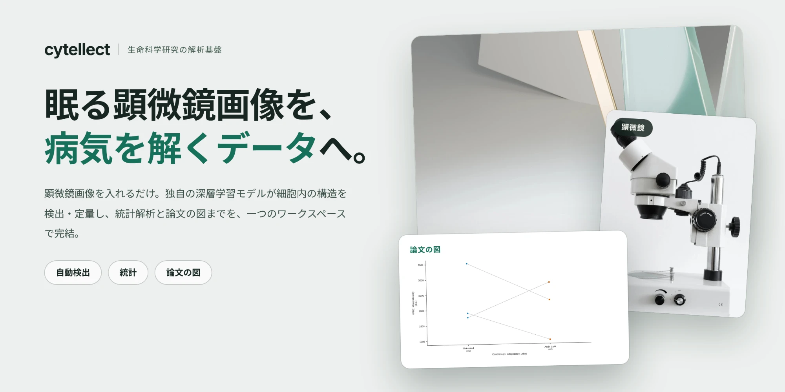
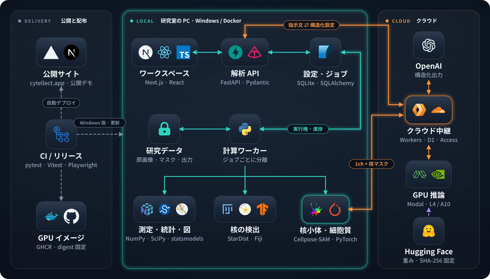
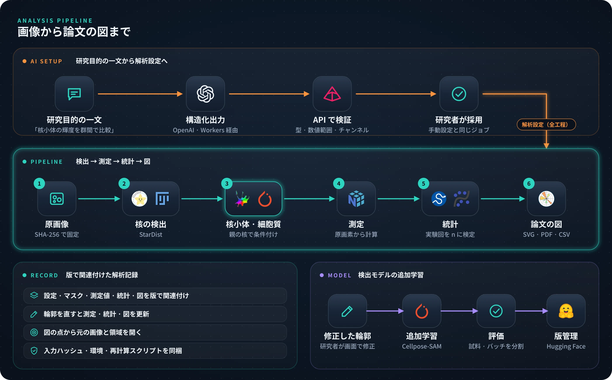

# Cytellect

**Get your microscopy publication-ready.**

[](https://cytellect.app/)

[プロダクト LP](https://cytellect.app/) · [公開デモ](https://cytellect.app/demo) · [Windows](https://github.com/genellect/cytellect/releases/tag/v0.1.0-local.21) · [Docker](docs/docker-desktop.md) · [統計解析手法](docs/implementation-overview.ja.md#統計解析) · [ドキュメント](docs/README.md)

Cytellect は、顕微鏡画像の解析から統計処理、グラフ出力までを一貫して引き受ける生命科学研究者のための解析基盤である。インスタンスセグメンテーションには深層学習モデルの StarDist と Cellpose-SAM（SAM ViT-L）、定量と統計的推論には NumPy・SciPy・statsmodels による共通実装を用いる。

## 開発に参加する方へ

開発に参加するときは次の 3 つを順に読み、作業のたびに関係する節を確認すること。AI エージェントも同じ文書に従う。

1. [チーム開発ルール](docs/team-development.md)：開発の進め方、Git とレビュー、研究データの扱い
2. [CONTRIBUTING](CONTRIBUTING.md)：開発環境の構築と起動、PR を出す前の検査
3. [開発の原則](docs/development-principles.md)：計算・統計・データ・画面・リリースで守る原則

そのほかの文書は[ドキュメント](docs/README.md)にまとめている。

## アーキテクチャ



画像の登録から論文の図までを研究室の PC で完結させ、GPU 推論と LLM だけを外部に切り出す構成。測定値と統計は、どの実行環境でも `packages/analysis` の同じ実装が生成する。

```
解析ジョブ
  apps/web                Next.js。画像・測定表・統計・図を一つの画面で編集
  → services/api          FastAPI。設定のバージョニングと、ジョブの永続化（SQLite）
  → services/worker       リース（実行権）を compare-and-swap で取得。ジョブ単位のプロセス分離
    → engines/fiji        核の検出（StarDist · TensorFlow Java）
    → engines/cellpose    核小体・細胞質の検出（Cellpose-SAM · PyTorch）。CPU または Modal の GPU
    → packages/analysis   測定・統計・作図（NumPy · SciPy · statsmodels · Matplotlib）

AI による解析設定
  services/api → services/proposal-worker（Cloudflare Workers · D1）→ OpenAI Responses API
  → API で検証 → 研究者が採用 → 手動設定と同じジョブ
```

### 実行環境

| 環境 | 実行場所 | 構成 | 外部に送るデータ |
|---|---|---|---|
| Windows 版 | 研究室の PC | 専用の Python・Fiji 環境。`127.0.0.1` で待ち受け | — |
| Docker 版 | 研究室の PC | Web・API・ワーカーを別コンテナで実行。ワーカーはネットワークから隔離 | — |
| GPU 推論 | Modal（L4 優先、A10 を予備候補） | GHCR の digest 固定イメージ。アイドル 20 秒でスケールダウン（`infra/modal_cellpose.py`） | 検出用の 1 チャンネルと核マスク |
| LLM の中継 | Cloudflare Workers · D1 | 費用の予約と精算（`services/proposal-worker`） | 指示文・チャンネルの対応・画像寸法・現在の設定 |
| 公開サイト | Vercel | LP と公開デモ。`main` へのマージで自動デプロイ | 研究画像は受け付けない |

### ディレクトリ構成

| ディレクトリ | 内容 |
|---|---|
| [`apps/web`](apps/web) | Web ワークスペース、LP、公開デモ（Next.js） |
| [`packages/analysis`](packages/analysis) | 検出・測定・統計・作図の共通実装。API・ワーカー・公開デモが同じコードを使う |
| [`packages/contracts`](packages/contracts) | API の OpenAPI 定義と既定レシピ。TypeScript 型の生成元 |
| [`services/api`](services/api) | 解析 API（FastAPI） |
| [`services/worker`](services/worker) | 計算ワーカー。ジョブ単位のプロセス分離で検出・測定・統計を実行 |
| [`services/proposal-worker`](services/proposal-worker) | LLM の中継と費用の管理（Cloudflare Workers · D1） |
| [`services/showcase`](services/showcase) | 公開デモの記録と再生（Pyodide） |
| [`engines/fiji`](engines/fiji) | StarDist による核の検出（Fiji プラグイン） |
| [`engines/cellpose`](engines/cellpose) | Cellpose-SAM の推論 runner と GPU サーバー。依存とモデルを固定 |
| [`engines/python`](engines/python) | Windows 版の Python ランタイムの固定 |
| [`infra`](infra) | Docker（Web・API・ワーカー）、Caddy による TLS、Modal の GPU サーバー |
| [`packaging/windows`](packaging/windows) | Windows 版のインストーラー（Inno Setup）、導入前の確認、CI での導入試験 |
| [`scripts`](scripts) | 開発の入口 `dev.py`、セットアップ、配布物と公開デモの構築、検証 |
| [`tests`](tests) | 数値計算・API・ブラウザ・Windows 導入の試験 |
| [`fixtures/public`](fixtures/public) | 試験と公開デモに使う公開画像。出典・ライセンス・ハッシュを登録 |
| [`docs`](docs) | 仕様、計算方法、運用の文書 |

## 画像認識



StarDist で検出した核を親領域として、核小体・細胞質を Cellpose-SAM で検出する階層的インスタンスセグメンテーション。

```
1. 原画像        SHA-256 で固定。測定は常に原画素から計算
2. 核の検出      StarDist（Fiji · TensorFlow Java）
3. 背景の正規化  親領域ごとに推定し、検出用の複製にのみ適用
4. 推論          Cellpose-SAM（SAM ViT-L）。親領域による条件付き推論
5. 候補の棄却    親領域全体を覆う候補を棄却
6. 境界の精緻化  Multi-Otsu · 距離変換 · Watershed
→ 原画像座標系の整数ラベル。核小体は親核の ID を保持
```

- 検出パスと測定パスの分離。前処理は検出用の複製に限定し、定量は原画素に対して行う
- 親領域による条件付き推論。基盤モデルの過検出（核全体・核外構造）を抑制する
- 実行環境の分離と固定。Fiji／TensorFlow Java と Cellpose-SAM／PyTorch を別の環境で実行し、依存パッケージとモデルの SHA-256 を読み込み前に照合する。実行時のネットワークアクセスを遮断
- CPU／GPU 間の再現性。GPU 推論は PC と同じ `runner.py`・モデル・ライブラリ版を使い、float32・TF32 無効・決定的アルゴリズムで実行する。返った結果は版のハッシュを照合し、一致しなければ採用しない

### 追加学習

```
研究者が修正した輪郭 → 教師データ → 追加学習（Cellpose-SAM）→ 評価 → 版管理（Hugging Face）
```

| 項目 | 内容 |
|---|---|
| 教師データ | 染色画像と、研究者が修正したインスタンスマスク |
| 対象 | 核小体・細胞質ごとに Cellpose-SAM を追加学習 |
| 評価 | 試料・撮影バッチ単位で分割し、境界精度・過分割・過少分割を評価 |
| 公開 | 学習データ・重み・推論条件を一組で版管理し、重みを [Hugging Face](https://huggingface.co/Genellect/Cytellect) で公開 |

## AI による解析設定

研究目的の一文を、LLM（GPT-6.1 Sol）が検出・測定・選別・統計・図の構造化設定に変換する。LLM の責務は設定の生成に限定し、数値計算は決定的な共通実装（`packages/analysis`）が行う。

- データ最小化。送信するのは指示文・染色とチャンネルの対応・画像寸法・現在の設定のみ。原画像・測定値・ファイル名は送信しない
- スキーマ検証。応答は Structured Outputs で受け、API 側で型・値域・チャンネルの整合性を再検証する。研究者が採用した設定だけを、手動設定と同じジョブで実行
- コスト制御。利用額は Workers と D1 で管理し、呼び出し前に最大の費用を原子的に予約、完了後に精算する。未精算の予約も上限に算入し、障害時にも上限を超えない

## 統計と論文の図

- 実験単位に基づく推論。細胞・視野・試料・独立した実験を区別し、独立した実験を n として検定する。細胞を n とする擬似反復（pseudoreplication）を排除する
- 来歴（provenance）の追跡。設定・マスク・測定値・統計・図を版で関連付け、上流（輪郭）の変更は、依存する測定・統計・図を無効化する
- トレーサビリティ。図の各データ点から、算出元の画像と領域へ遡及できる
- 計算と描画の分離。体裁（色・軸）の変更は再描画のみで、測定と検定は再実行しない
- 再現可能な出力。図は SVG（文字を編集可能）・PDF（フォント埋め込み）・CSV で出力し、入力ハッシュ・マスク・設定・環境・再計算スクリプトを同梱する

## 結果の整合性

同じ入力と設定からは同じ結果を出し、古い計算が新しい結果を上書きしない。

| 性質 | 実装 |
|---|---|
| 冪等性 | ジョブを DB に永続化し、要求 ID で重複を排除 |
| 排他制御 | リース（実行権）を compare-and-swap で取得し、結果の確定時に再検証 |
| 楽観的並行性制御 | 設定の更新時に版を照合し、競合時は `409 Conflict` |
| 表示の一貫性 | 画面は、対象と設定の版が一致する応答だけを反映 |
| 障害の分離 | ジョブ単位の作業ディレクトリとプロセス |

## セキュリティと研究データの扱い

Cytellect は、未発表の研究データという秘匿性の高い情報を扱う。そのうえでコードを OSS として公開し、研究室の利用者がいるクラウドの機能を運用しているため、研究データの扱いとセキュリティを明文化している。

研究データはクラウドに置かず、更新は署名で検証する。そのため、クラウドのサービスやリポジトリが侵害されても、保存された研究データと利用者の PC には届かない。設計の詳細と脆弱性の報告方法は [SECURITY.md](SECURITY.md) にまとめている。

## 開発

開発環境の構築と起動の手順は [CONTRIBUTING](CONTRIBUTING.md) にまとめている。

| 環境 | 特徴 | セットアップ |
|---|---|---|
| [クラウド開発](CONTRIBUTING.md#クラウド開発) | 固定版の開発ツールと Fiji を備えたクラウド環境。手元への導入は不要 | Claude Code は `bash .claude/cloud-setup.sh`、Codex は `bash .codex/setup.sh` |
| [ローカル開発](CONTRIBUTING.md#ローカル開発) | 手元の PC とブラウザで操作。開発サーバーで Web の変更を即時に反映 | `python3 scripts/dev.py setup --fiji ~/cytellect-fiji` |

どちらの環境も `python3 scripts/dev.py serve` で起動し、PR の前に `python3 scripts/dev.py check` で CI と同じ検査を行う。CI の対象は、型・API 契約、数値計算、実 Fiji とブラウザの連携、Windows 版の導入、依存パッケージの監査である。統計の実装は、閉形式解と全列挙による独立実装で検証している。

## ライセンス

コードは [Apache License 2.0](LICENSE) で OSS として公開している。第三者のコンポーネントには、それぞれのライセンスが適用される。

| 対象 | ライセンス | 扱い |
|---|---|---|
| Fiji | GPL-3.0（Bio-Formats は GPL、MorphoLibJ は LGPL-3.0） | リポジトリと Windows 版の ZIP には含めない（導入時、Docker 版はイメージのビルド時に公式の配布元から取得する）。Windows 版のインストーラーは、公式の配布物をそのまま同梱する（Python と依存パッケージも同じ）。同梱物のライセンス本文はインストーラーとその受領記録に含め、GPL・LGPL などソースの提供が必要なものは、同梱した版ちょうどのソースを同じリリースの資産 `Cytellect-<版>-gpl-sources.zip` として添付する。ソースを取得できない 42 個は上流のソースの所在だけを記す（[第三者のソフトウェア](docs/oss.md#gpl-などの対応するソース)）。どちらも別プロセスとして実行する |
| Cellpose の依存（fastremap、fill-voids） | LGPL-3.0 | 改変せずに利用する |
| 学習済みモデル（StarDist、Cellpose-SAM の `cpsam_v2`） | BSD-3-Clause（StarDist はモデルのリポジトリ、`cpsam_v2` はモデルカードで宣言） | 導入時に公式の配布元から取得し、SHA-256 を照合する |
| 追加学習した重み | BSD-3-Clause | Cellpose の著作権表示と改変した旨を添えて、[Hugging Face](https://huggingface.co/Genellect/Cytellect) で公開する |
| 公開画像 | CC0-1.0（BBBC007、BBBC039、JUMP）、CC BY 3.0（BBBC013）、4DN の公開データ利用方針 | 出典を記録する。4DN の原画像は再配布しない |
| LP の写真、図中のロゴ | Pexels・Unsplash の各ライセンス、各社の商標 | ロゴはソフトウェアの識別にだけ使う |

依存パッケージのライセンスは CI が SBOM として記録する。モデルごとのソフトウェア・重み・学習データの記録は[第三者ソフトウェアと重み](docs/oss.md)にある。

## 開発者

Cytellect は、松井優知（Yuto Matsui、[@genellect](https://github.com/genellect)）が中心となって開発している。開発者はシステムエンジニアとして働きながら、分子生物学の研究にも関わっている。経歴は[ポートフォリオ](https://yuto-matsui.com/)で公開している。
