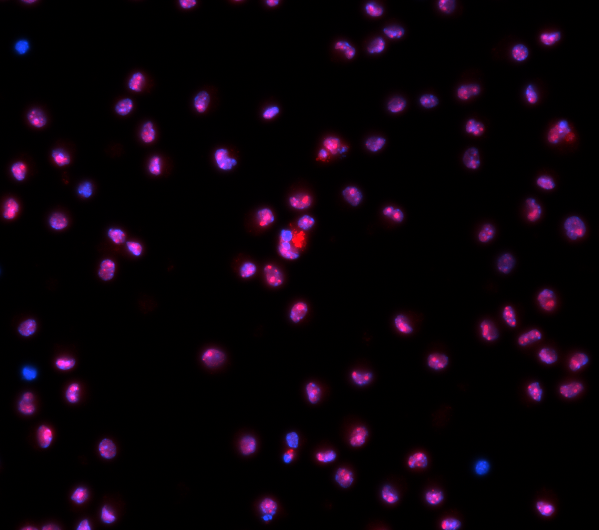
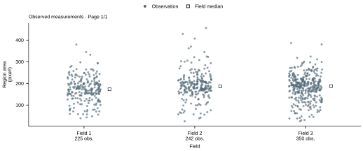

# Cytellect 解析機能（2026年10月）

蛍光免疫染色やGFP発現細胞の2次元画像から、核ごとの量を測り、群間比較と作図まで行います。
対象は、核とその内部（核小体）で起きる変化です。

## 対応する実験

| 調べたいこと | 必要な画像 | Cytellect が出す値 |
|---|---|---|
| 処理で核内タンパク質の量が変わるか | 核染色 ＋ 目的タンパク質 | 核ごとの平均輝度・積分輝度 |
| 核小体ストレスで NCL が核質へ移るか | DAPI ＋ NCL | 核質と核小体の輝度比（log2） |
| 核小体の数や大きさが変わるか | DAPI ＋ NCL | 核あたりの核小体の数、核に占める面積の割合 |
| 核が大きくなる・小さくなるか | 核染色のみ | 核の面積（µm²） |
| GFP を発現した細胞だけで評価したいか | 核染色 ＋ GFP | GFP 陽性の核に限った各測定値 |
| 2つの量が連動しているか | 上記のいずれか2つ | 相関係数と散布図 |

いずれも、対照と処理など2群以上を、独立した実験の繰り返しを単位として比べます。

## 入力から出力まで

**入力**：DAPI と NCL の2色で染めた核の画像（公開データ 4DN）

**核の自動検出**：検出した核の輪郭を画像に重ねて表示します。誤りは追加・削除・結合・分割で直せます。

**出力**：核ごとの値をまとめた図です。下の図は、公開画像（BBBC013）3視野、817個の核の面積を視野ごとに示しています。図と同時に、全核の値の CSV が書き出されます。

## 画像から得られる値

| 測定値 | 定義 |
|---|---|
| 核の面積 | 核の画素数 × 画素の面積（µm²） |
| 平均輝度・積分輝度 | 核内の画素値の平均と合計。元画像の値をそのまま使う |
| 背景補正輝度 | 上の値から、核の外に指定した背景領域の中央値を引いた値 |
| 核小体の数・面積割合 | 核ごとの核小体の個数と、核に占める核小体の面積の割合 |
| 核質/核小体比 | 核小体を除いた核質の平均輝度 ÷ 核小体の平均輝度（log2 も出す） |
| GFP 陽性・陰性 | 核内 GFP 輝度によるしきい値判定。手動、撮影日ごとの Otsu 法、陰性対照基準から選ぶ |

**検出の方法**
- 核：Fiji の StarDist（蛍光核用に学習済みの検出モデル）で検出します。
- 核小体：核ごとに、NCL の輝度で Otsu 法のしきい値を決めて抽出します。DAPI の暗い部分から抽出することもできます。

**値の扱い**
- 輝度の調整や検出用の処理は複製に対して行い、測定には元の画素値を使います。
- 飽和した核と画像の端にかかる核には印が付きます。除外するかどうかは研究者が決めます。
- 背景を指定していない場合の補正値や、核小体がない核の比は、0 ではなく空欄として理由を記録します。

## 統計の単位（n）

Cytellect は、細胞数ではなく、独立した実験の繰り返し（実験回や個体）を n として検定します。

同じ皿の細胞は、培養・染色・撮影の条件を共有しています。
そのため、ある回だけ染色が明るいといった回ごとの違いが、その回の細胞すべてに一緒に乗ります。
細胞数を n にすると、この違いを処理の効果と区別できず、差がなくても有意になりやすくなります。

差のないデータを計算機上で400回作って検定した結果です（`scripts/exploratory_model_null_simulation.py`）。

| 解析の単位 | p < 0.05 になった割合（本来は5%以下） |
|---|---|
| 細胞（視野ごとに誤差をまとめた回帰） | 32% |
| 実験回（Cytellect の方法） | 2.8% |

値は次の順にまとめます。例は、1群あたり独立実験3回・各5視野・1視野約100細胞の場合です。

| 段階 | 数 | まとめ方 | 理由 |
|---|---|---|---|
| 細胞 → 視野 | 約100 → 1 | 中央値 | 外れた細胞や誤検出の影響を抑える |
| 視野 → 実験回 | 5 → 1 | 平均 | 視野数や細胞数が回ごとに違っても、各回を同じ重みにする |
| 検定 | 3 | ― | n = 3（1500 ではない） |

次のような割り当ては受け付けません。

- 1つの視野を2つの群に入れる
- 対応のない比較で、同じ実験回を両方の群に入れる
- 対応のある比較で、相手が欠けた回を含める

## 統計解析

| 実験デザイン | 検定 |
|---|---|
| 2群・独立 | Welch の t 検定 ／ Mann–Whitney U 検定 |
| 2群・対応あり（同じ回の対照と処理など） | 対応のある t 検定 ／ Wilcoxon 符号付き順位検定 |
| 3群以上 | Welch の分散分析 ／ Kruskal–Wallis 検定。続けて、事前に決めた2群間比較を Holm 法で補正 |
| 2つの量の関係 | Pearson ／ Spearman の相関 |

- 結果には p 値に加えて、差の推定値と95% 信頼区間が付きます。
- n が小さい場合は、すべての並べ方を数え上げる正確な p 値を使います。
- 正規性の検定の結果で手法を切り替えることはしません。
- 1群が5回未満のときは警告を表示します。

## 作図

| 図 | 内容 |
|---|---|
| 視野ごとの分布 | 細胞の値と視野の中央値。撮影のばらつきや外れた視野を見つける（上の出力例） |
| 群の比較 | 細胞・視野・実験回の値を重ね、実験回の平均と95% 信頼区間を示す（SuperPlot） |
| 実験回の値の分布 | 点、箱ひげ、バイオリン、ヒストグラム、対応のある値をつなぐ線 |
| 相関 | 実験回ごとの散布図 |

- 図の点を選ぶと、その核が写った元画像が開きます。
- 寸法は Nature の1段幅（89 mm）・2段幅（183 mm）または任意の値を指定できます。配色は色覚の違いに配慮しています。
- 書き出せるものは次のとおりです。
  - 図：SVG（Illustrator で文字を編集できる）、PDF、PNG（300 dpi）
  - 細胞・視野・実験回ごとの値を収めた CSV
  - Methods の文案
  - ImageJ で開ける領域ファイル

## 精度の検証

| 対象 | 方法 | 結果 |
|---|---|---|
| 測定値の計算 | 公開画像3種（BBBC007、BBBC013、4DN）の同じ領域を ImageJ で測り比較 | 面積・平均・中央値が一致 |
| 統計の計算 | 手計算・全組み合わせの数え上げと比較 | 一致 |
| 核の検出 | 正解付き公開画像（BBBC039）で評価 | F1 = 0.92。ただしこの画像は検出モデルの学習データと重なる |
| 核小体の検出 | ― | 正解付きの公開データがなく未評価 |
| 再現性 | 書き出した一式から再計算 | 同じ数値と図を再現 |

計算は ImageJ と一致します。一方、核と核小体の検出精度は、使用する画像で確認が必要です。

## AI による解析計画の提案（任意）

目的を一文で書くと、外部の言語モデルが、どの値を測り、どの検定と図を使うかを提案します。初期設定では使いません。

| AI が行う | AI は行わない |
|---|---|
| 測定値・検定・図の組み合わせを提案する | 核や核小体を検出する |
| 不足している情報（実験回の割り当てなど）を指摘する | 測定値や p 値を計算する |
| 提案の理由を示す | 結果を解釈する |

- AI に送るのは、チャンネルの記号、染色名、視野と群の数、目的の文だけです。画像や測定値は送りません。
- 番号だけのチャンネルを GFP と決めつける提案や、実験回が足りないのに検定する提案は、表示する前に除きます。
- 提案は研究者が採用するまで実行されません。

## 未対応

| 分野 | 内容 |
|---|---|
| 画像 | 3次元（Z スタック）、タイムラプス、斑点（foci）の検出、細胞質の自動検出 |
| 統計 | 混合効果モデル、3条件以上の対応のある比較（Friedman など）、Tukey などの事後検定、効果量（Cohen の d）、検出力の計算 |
| 作図 | 複数パネルの組図、顕微鏡画像パネルとスケールバー、対数軸、SD・SEM のエラーバー |

詳細は [解析法](methods.md)、[統計](common-statistics.md)、[作図](figures.md)、[公開画像での検証](public-validation.md) を参照してください。
