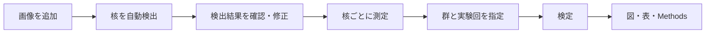

# Cytellect でできる解析

蛍光免疫染色の画像を入れると、核を自動で検出し、核ごとの面積と輝度を測り、実験群を比べる検定と論文用の図まで作ります。

## 解析の流れ

研究者が行うのは、画像の追加、検出結果の確認、群と実験回の指定の3つです。

## 例：対照と処理で NCL の量を比べる

**実験の条件**

| 項目 | 内容 |
|---|---|
| 染色 | DAPI（核）、NCL（核小体） |
| 群 | 対照、処理 |
| 繰り返し | 独立した実験を3回。各回で5視野を撮影 |

**解析の手順**

| 手順 | Cytellect が行うこと | 研究者が行うこと |
|---|---|---|
| 1. 画像を追加 | ファイル名から視野とチャンネルをまとめる | 30視野分の TIFF を選ぶ |
| 2. 核の検出 | DAPI で核を検出し、NCL から核小体を抽出する | ― |
| 3. 確認 | 検出した核を画像に重ねて表示する | 誤検出を消す・足す |
| 4. 測定 | 核ごとに面積、NCL の輝度、核小体の数を測る | ― |
| 5. 比較 | 各回の値をまとめ、n = 3 で検定する | 各視野がどの群・何回目の実験かを指定する |
| 6. 出力 | 図、全データの CSV、Methods の文案を作る | 図の大きさと文字を調整する |

## 測れるもの

| 知りたいこと | 測定値 |
|---|---|
| 核の大きさ | 核の面積（µm²） |
| タンパク質の量 | 核内の平均輝度・積分輝度（背景を引いた値も） |
| 核小体の数と大きさ | 核あたりの核小体の数、核に占める面積の割合 |
| 核小体への局在 | 核質と核小体の平均輝度の比（log2） |
| GFP 陽性の細胞 | 核内の GFP 輝度と、陽性・陰性の判定 |

画像が飽和している核や、画像の端にかかる核には印が付きます。除くかどうかは研究者が決めます。
計算できない値（背景を指定していない場合の補正値、核小体がない核の輝度比など）は0にせず、空欄として理由を残します。

## 詳しく：なぜ細胞数ではなく実験回を n にするのか

### 細胞は独立ではない
同じ皿の細胞は、同じ培養条件、同じ抗体の希釈、同じ撮影条件の影響を一緒に受けます。
処理による差がなくても、実験回ごとの違いは細胞の値すべてにそのまま乗ります。
例えば1回目の実験だけ染色が少し明るかった場合、その回の細胞はすべて明るくなります。

細胞数（例では1群1500個）を n にすると、この実験回ごとの違いを「処理による差」と区別できなくなります。
その結果、実際には差がないのに p < 0.05 となる割合が大きく増えます。

### どれくらい増えるか
差のないデータを計算機上で400回作り、2つの方法で検定しました（`scripts/exploratory_model_null_simulation.py`）。

| 方法 | p < 0.05 となった割合 | 本来あるべき値 |
|---|---|---|
| 細胞を単位にした回帰（視野ごとに誤差をまとめる方法） | **32%** | 5% |
| Cytellect の方法（実験回を n にする） | **2.8%** | 5% 以下 |

細胞単位の解析では、差がなくても約3回に1回は「有意」となりました。

### Cytellect のまとめ方
例の対照群1つ分で示します。

| 段階 | 数 | 次の段階へのまとめ方 |
|---|---|---|
| 細胞 | 1視野あたり約100 | 視野ごとに中央値を取る |
| 視野 | 1回あたり5 | 実験回ごとに平均を取る |
| 実験回 | 3 | この3つの値で検定する |

- **視野の中では中央値**：外れた細胞や誤検出に引きずられにくくするためです。
- **実験回の中では平均**：視野の数が回によって違っても、各回が同じ重みになるようにしています。細胞が多い視野ほど重くなることもありません。

### 誤りを防ぐ仕組み
- 1つの視野を2つの群に割り当てることはできません。
- 対応のない比較で、同じ実験回が両方の群に入ることもできません。
- 対応のある比較（同じ回の対照と処理など）では、相手が欠けた回があると検定しません。
- 1群が5回未満のときは、その旨を表示します。

細胞・視野・実験回の値はすべて CSV に残り、図にも重ねて描かれます。
「どの細胞の値が、どの視野の値になり、どの実験回の値になったか」をあとから確かめられます。

## 使われる検定

| 実験デザイン | 検定 |
|---|---|
| 2群、別々のサンプル | Welch の t 検定、または Mann–Whitney U 検定 |
| 2群、同じ回の対照と処理など対応のあるデータ | 対応のある t 検定、または Wilcoxon 符号付き順位検定 |
| 3群以上 | Welch の分散分析、または Kruskal–Wallis 検定。そのあと、あらかじめ決めた2群どうしを比べる（Holm 法で補正） |
| 2つの測定値の関係 | Pearson または Spearman の相関 |

検定の結果には、p 値だけでなく、差の大きさと95% 信頼区間が付きます。
n が小さいときは、すべての並べ方を数える正確な計算で p 値を出します。

## 作れる図

| 図 | 見えるもの |
|---|---|
| 視野ごとの分布 | 各視野の細胞の値。撮影のばらつきや外れた視野を確認できる |
| 群の比較 | 細胞・視野・実験回の値を重ね、実験回の平均と95% 信頼区間を示す（SuperPlot 形式） |
| 実験回の分布 | 点、箱ひげ、バイオリン、ヒストグラム、前後をつなぐ線 |
| 相関 | 実験回ごとの散布図 |

- 図の点を押すと、その細胞が写った元の画像が開きます。
- 図は Nature の1段幅（89 mm）と2段幅（183 mm）に合わせられます。配色は色覚の違いに配慮しています。
- 書き出すと、図（SVG・PDF・PNG）、全データの CSV、Methods の文案、ImageJ で開ける領域ファイルが得られます。SVG の文字は Illustrator などで編集できます。

## どこまで信頼できるか

| 項目 | 状況 |
|---|---|
| 測定値の計算 | 公開画像3種で ImageJ と同じ値になることを確認済み |
| 統計の計算 | 手計算の値や全組み合わせの数え上げと一致することを確認済み |
| 元の画像 | 変更しない。検出のための処理は複製に対して行う |
| 再現性 | 書き出した一式から、同じ数値と図を作り直せる |
| 核の検出 | 公開画像で F1 0.92（正しく検出できた割合の指標）。ただし検出モデルの学習に使われた画像と重なっており、独立した評価ではない |
| 核小体の検出 | 正解付きの公開データがなく、精度は未評価 |

計算は正確ですが、検出が正しいかどうかは、まず数枚の画像で目視で確認してください。

## AI の担当

AI（外部の言語モデル）は、解析の計画を提案するだけです。使うかどうかは選べ、初期設定では使いません。

| AI が担当すること | AI が担当しないこと |
|---|---|
| 「処理で核小体の NCL が減るかを見たい」のような目的から、測定項目・検定・図の組み合わせを提案する | 画像から核を検出する |
| 足りない情報（実験回の指定など）を挙げる | 測定値や p 値を計算する |
| 提案の理由を短く示す | 結果の解釈や結論を書く |

AI に送るのは、チャンネルの記号、染色名、視野や群の数、目的の文だけです。画像と測定値は送りません。

AI の提案は、Cytellect が検査してから表示します。次のような提案は表示しません。

- 番号だけのチャンネル（`c2` など）を GFP だと決めつける
- 撮影していない染色を測る
- 実験回が足りないのに検定する
- 細胞数を n にする

表示された提案を研究者が採用したときだけ、解析が始まります。

## まだできないこと

| 分野 | 内容 |
|---|---|
| 統計 | 混合効果モデル、3条件以上の前後比較（Friedman など）、Tukey などの事後検定、効果量（Cohen の d）、検出力の計算 |
| 図 | 複数パネルの組図、顕微鏡画像のパネルとスケールバー、対数軸、SD・SEM のエラーバー |
| 画像 | 3次元・タイムラプス、斑点（foci）の検出 |

## 詳しい資料

[解析法](methods.md)・[統計](common-statistics.md)・[図](figures.md)・[公開画像での検証](public-validation.md)・[未完了の項目](roadmap.md)
